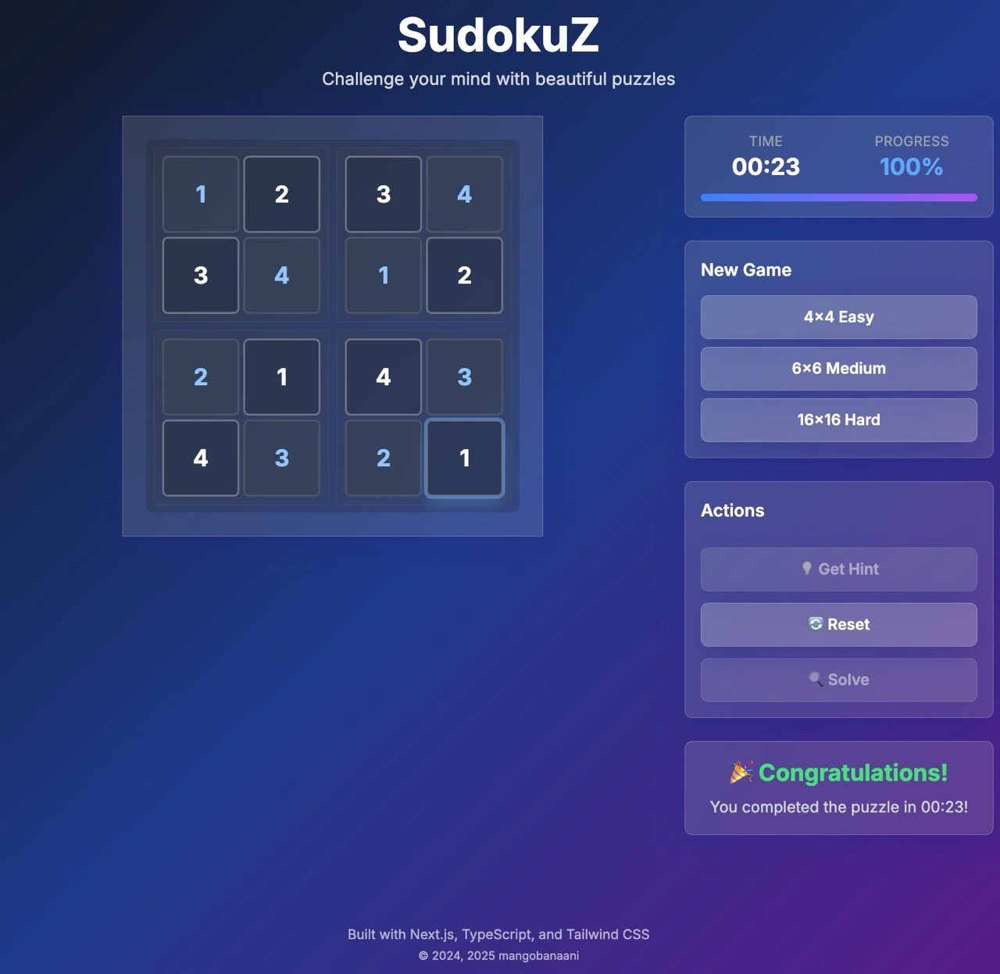

# SudokuZ

A modern, multi-size Sudoku game featuring 4×4, 6×6, and 16×16 grids. Perfect for all skill levels from beginners to experts.




## Features

### Multiple Grid Sizes
- **4×4 Easy** - Perfect for beginners and kids (2×2 sub-grids)
- **6×6 Medium** - Balanced challenge with good learning curve (2×3 sub-grids) 
- **16×16 Hard** - Expert level with complex patterns (4×4 sub-grids)

### Smart Gameplay
- **Generate puzzles** - Creates valid Sudoku grids with appropriate difficulty
- **Solve automatically** - Advanced algorithm handles any valid puzzle
- **Real-time validation** - Highlights conflicts as you play
- **Hint system** - Get unstuck with intelligent suggestions
- **Progress tracking** - Visual completion percentage and timer

### Mobile-First Design
- **Touch-optimized** - Responsive cells that adapt to grid size
- **Mobile number pad** - Context-aware input for different grid sizes
- **Smooth animations** - Glass UI with fluid transitions
- **Cross-platform** - Works seamlessly on desktop, tablet, and mobile

## Getting started

```bash
npm install
npm run dev
```

Open [http://localhost:3000](http://localhost:3000) and start playing.

## Tech stack

- **Next.js 15** - React framework with App Router and SSR
- **React 19** - Latest React with concurrent features and improved hydration
- **TypeScript** - Full type safety with strict mode
- **Tailwind CSS** - Utility-first styling with responsive design
- **Framer Motion 12** - Smooth animations and micro-interactions
- **Playwright** - Comprehensive testing across devices and browsers

## Development

### Quick start
```bash
npm install
npm run dev
```

Open [http://localhost:3000](http://localhost:3000) and start playing.

### Available commands
```bash
npm run dev          # Start development server
npm run build        # Build for production  
npm run start        # Start production server
npm run test         # Run unit tests (29 tests)
npm run test:e2e     # Run browser tests (376 tests across browsers)
npm run test:mobile  # Test on mobile devices (5 device types)
npm run lint         # Run ESLint code quality checks
```

### CI/CD Pipeline
Modern DevOps workflow with manual triggers and Node.js 20:
```bash
# GitHub Actions workflows available
.github/workflows/ci.yml          # Comprehensive CI pipeline
.github/workflows/deploy.yml      # Multi-environment deployment
.github/workflows/quality-gate.yml # Security & performance audits
```

## Testing

Comprehensive test suite covering:
- **Unit tests** - Jest with React Testing Library (29 tests)
- **E2E tests** - Playwright across browsers (376 tests total)
- **Cross-browser compatibility** - Chrome, Firefox, Safari, Edge
- **Mobile devices** - iPhone 12, iPhone SE, Pixel 5, Galaxy S8, iPad Pro
- **Accessibility compliance** - WCAG guidelines
- **Performance benchmarks** - Lighthouse CI integration
- **Security scanning** - Dependency and vulnerability checks

## Mobile optimization

Fully responsive with dedicated mobile features:
- **Touch-friendly cells** - 44px minimum touch targets
- **Adaptive sizing** - Cells scale based on grid complexity (4×4 large, 16×16 compact)
- **Mobile number pad** - Context-aware input for different grid sizes
- **Orientation support** - Works in portrait and landscape modes
- **Tested extensively** - Real device testing across iOS and Android

## Deployment

Deploy anywhere that supports Next.js 15:
- **Vercel** (recommended) - Zero config deployment with preview environments
- **Netlify** - Static export support with edge functions  
- **Docker** - Containerized deployment ready for any cloud provider

See `CI_CD_GUIDE.md` for complete DevOps setup including GitHub Actions workflows.

## License

This project is licensed under the GNU General Public License v3.0 - see the [LICENSE](LICENSE) file for details.

---

© 2024, 2025 mangobanaani. Built with TypeScript and tested on real devices.
